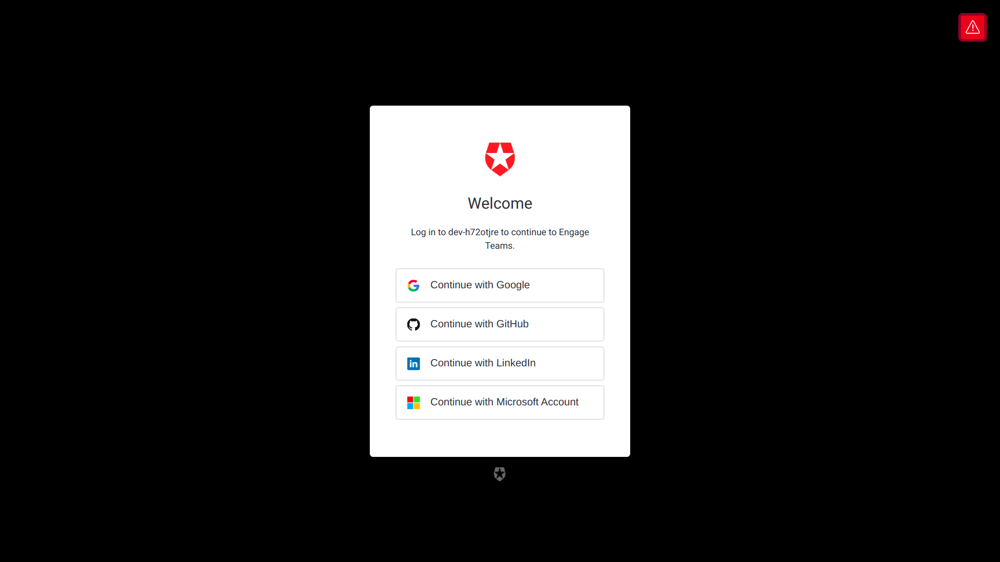

[Introduction of Microsof Teems](#microsof-teems)
  * [Live Demo Link](#live-demo)
  * [Deployment URL](#deployment)
  * [Built With](#built-with)
  * [User Stories](#user-stories)
  * [Features](#features)
      - [Video Call](#video-call)
      - [Authentication](#authentication)
      - [Chat](#chat)
      - [Micro-Interactions and User Experience](#micro-interactions-and-user-experience)
  * [Implementation and the Agile Workflow](#implementation-and-the-agile-workflow)
      - [Sprint 1:](#sprint-1-)
      - [Sprint 2:](#sprint-2-)
      - [Sprint 3:](#sprint-3-)
  * [What did the project acheive](#what-did-the-project-acheive)
  * [Further Scope](#further-scope)
  * [👤 Author](#---author)
  * [🤝 Contributing](#---contributing)
  * [Show your support](#show-your-support)
  * [Acknowledgments](#acknowledgments)

# Microsof Teems

> Microsof Teems is a clone project of [Microsoft Teams](https://www.microsoft.com/en-in/microsoft-teams/group-chat-software)  Web Application (built as a part of Microsoft Engagement & Mentorship Program – Engage 2021). It includes great features such as chat, user authentication, and videoconferencing along with a user-friendly interface.


[Back to top](#)

## Live Demo

[Live Demo Link](https://youtu.be/tZFsDGudLCk)

## Deployment
The web app is deployed on https://microsof-teems.el.r.appspot.com/

[Back to top](#)

## Built With

- Languages :- JavaScript
- Frameworks :- React, Node, Express, Tailwind CSS 
- Authentiaction :- OAuth (by [AuthO](https://auth0.com/))
- Libraries :- [Socket.IO](https://socket.io/docs/v4/index.html), [simple-peer](https://www.npmjs.com/package/simple-peer), [Material-UI](https://material-ui.com/), [axios](https://www.npmjs.com/package/axios), [react-router-dom](https://reactrouter.com/web/api/BrowserRouter)
- APIs :- [WebRTC](https://webrtc.org/)
- Additional Tools :- npm, git

## User Stories
The project was built on an agile-scrum methodology which tried to address the following user stories:
- As a member of the Ace Hacker Team, I want the mandatory feature of video-call to connect at least two users.
- As a student, I want the feature of mute/unmute the mic and also switch on/off the video.
- As a Govt Employee, I want the feature to allow and disallow people to join the meeting.
- As a surprise feature the Stake-Holder (Ace Hacker 🤨), has asked to include a meeting chat feature allowing chat communication even after the meeting is done.
- As a Developer, I want only verified users to use the product.
- As a Senior Software Engineer, I want the site to be personalized and interactive with an appealing user interface.

[Back to top](#)

## Features
1. #### Video Call
    - The application supports Group Video Call of theoretically infinite but practically, depending on the bandwidth of the users.
    - The home page has options to **start** a new meeting or **join** an ongoing meeting using the **meeting link**. The users can join the meeting by **directly** typing in the URL in the browser window too.
    - The meeting link is **validated** for it's existence before any user can enter the meeting.
    - Participants have an option to copy the **meeting link** using a button.
    - The **meeting organizer** has on option to **admit** or **deny** the entry of someone trying to join the meet.
    - The **Control Tray** at the bottom provides the following features:
        - Copy the meeting link
        - Mute/unmute the mic
        - Switch on / off the video stream
        - Present the screen
        - Hide/unhide the meeting chat
        - Leave the meeting

    

2. #### Authentication

    It is **mandatory** for a user willing to use the application to log in and thereby authenticate by any one of the following methods:
    - Gmail Account
    - Github Account
    - LinkedIn Account
    - Microsoft Account

    

3. #### Chat

    As soon as a **meeting starts**, a separate chat is created in which all the participants are added as and when they join the meet. The users can **not only** chat during the meeting but also continue to chat once the meeting ends. The meeting chat allows the user to only send messages while the following features are provided in the chat **after** the meeting ends:
    - The **organizer** has the option to add and remove users from the chat.
    - The chat supports all the **typographic emphasis** options including **bold**, *italics* and ```code segments```. Apart from that, the option to upload a picture or a file is also present.
    - The **status** of whether someone is **typing**
    - Online and Offline users.
    - **Delete** a conversation (chat).
    - **Create** new chats: This allows the users of the web app to create separate conversation channels and communicate with each other.

    

4. #### Micro-Interactions and User Experience
    The following features ensure that each user has an enriching experience:
    - **Single-page** application without reloads ensures a very little response time.
    - **Welcome Message** customized to the name of the user at the top right of the home page.
    - **Alert** on entering an **invalid** meeting link.
    - Welcome **notification** on **joining** the meeting.
    - Notification to tell the user that the meeting link is **copied**.
    - Notification prompting the user that the **message** in the meeting chat **cannot be blank**.
    - Customized Alert Dialog box tells the user in case the **connection fails**.
    - Lastly, the **Goodbye message** appears when the user log's out of the web application.

[Back to top](#)

## Implementation and the Agile Workflow

The development in this project had adopted an **Agile Scrum** methodology. Since it was in individual project, every role of the development team was done by the author himself. However, the **user stories** were taken as a **feedback** from **family** members, **friends**, **mentors** and also by the features as suggested by the **Ace Hacker** team. The overall development included three sprints:

#### Sprint 1:

The focus of this sprint was to implement the **mandatory** feature with some **additional** features too. It can be summarized as:


#### Sprint 2:

The focus of this sprint was to implement the **authentication** feature along with building the **front-end** of the web-site. It can be summarized as:


#### Sprint 3:

The focus of this sprint was to implement the **surprise** feature announced by Ace Hacker along with feature of **admit/deny** and **micro-interactions**. It can be summarized as:


## What did the project acheive
- Every sprint was able to acheive it's own definition of **Done** and was therefore successful in building the mentioned features in the feature section.
- Apart from that this project has given a real good insight regarding one of the **development methodologies used by Microsoft** to build some of it's products (i.e. **Agile Scrum**).
- The interaction with the **mentors** of **Microsoft** and **representatives** from the **Ace Hacker team** were **insightful** and helped a lot in **structuring** the workflow and overall **development** of the project.

[Back to top](#)

## Further Scope
- The major backlog of Sprint 3 is to **improvise** on the **User Interface** of the **Chat** feature.
- Apart from that features such as **White-Board**, **IP Call** and **Emojis** can be added in future sprints to make the product more usable.
- Lastly, as **more and more users** are added **bugs** would keep popping in and **User Stories** would add on which would form a basis for further sprints.

## 👤 Author

- GitHub: [@sksingh1202](https://github.com/sksingh1202)
- LinkedIn: [saket-kum-singh](https://www.linkedin.com/in/saket-kum-singh/)

## 🤝 Contributing

**Although** this was an **individual** project and there is just one contributor right now (as of July 2021), I am **open to contributions**, issues, and  requests in the **future**!

[Back to top](#)

## Show your support

Give a ⭐️ (at the top right of this web-page) if you like this project!

## Acknowledgments

- **Authors** of the well-documented **frameworks**, **libraries**, and **APIs** which were used to build the project
- **Mentors** from the **Microsoft Team** who guided and more importantly kept **motivating** me throughout the entire journey of the project
- **Coding buddies** with whom I could discuss the **bugs** and **fixtures**
- **Family**, for their **moral** support and help in **testing** this product without which the outcome was improbable
- **Special** Thanks to **Ace Hacker** and **Microsoft** for all the support and for giving such a wonderful **opportunity to learn** in the form of **Engage 2021**
- **Thanks** to **every** individual who directly (or indirectly) helped me build this wonderful project

[Back to top](#)